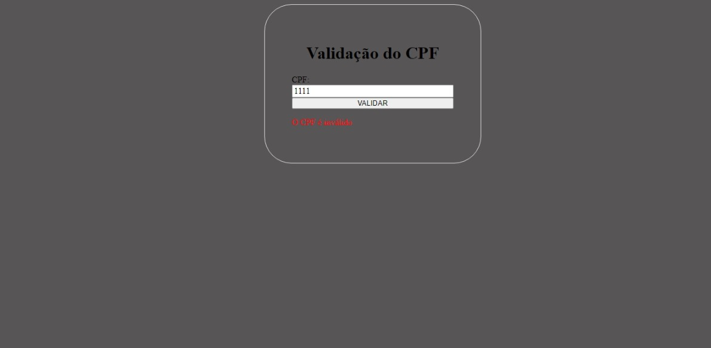

# Cpf e do E-mail 
 
 

# validação do cpf
 Implementamos essa funcionalidade usando JavaScript para garantir que todos os campos obrigatórios sejam preenchidos corretamente pelos usuários. Se algum campo estiver incorretamente preenchido, um alerta será exibido, solicitando a correção das informações.
 * a mensagem que ira aparecer 
 

 # validação do e-mail
 Quando você preenche o formulário, se esquecer de inserir o símbolo "@" e o ponto "." no campo de email, um alerta será exibido na parte superior da página informando que todos os campos devem ser preenchidos corretamente. Depois que todos os campos estiverem preenchidos corretamente, um botão na parte inferior do formulário será habilitado. Ao clicar neste botão, você será direcionado para a validação do seu CPF.

 

